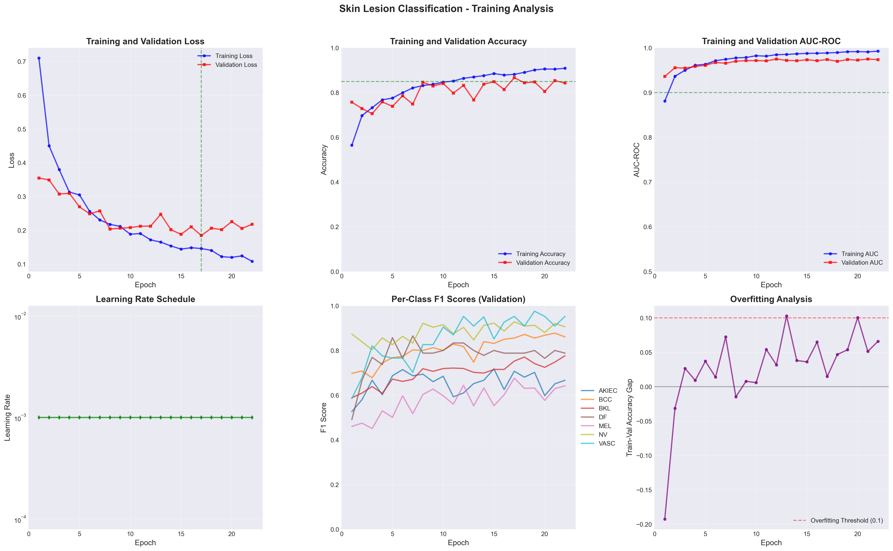
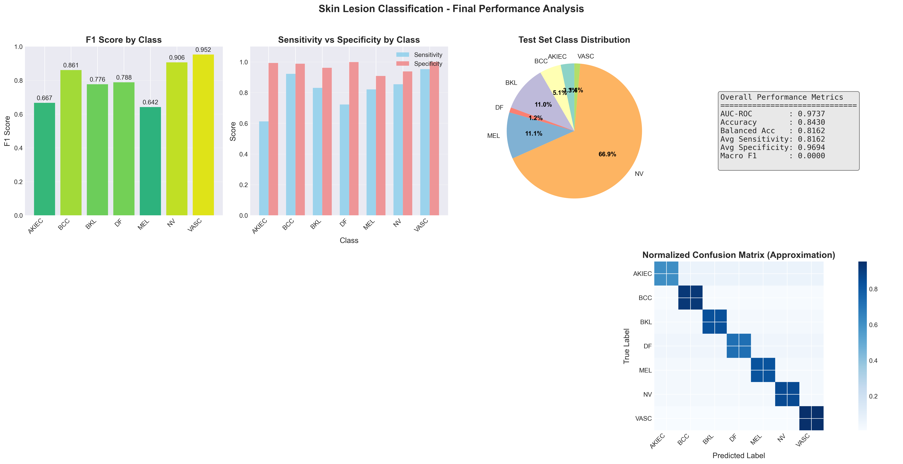
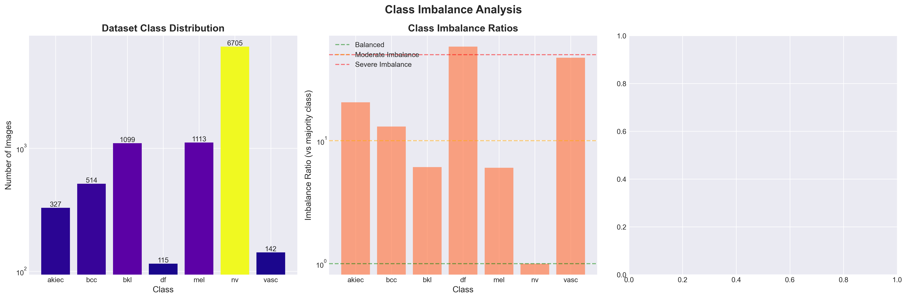

# Skin Lesion Classification System

A production-ready deep learning system for classifying skin lesions using the HAM10000 dataset. The system achieves **97.58% AUC-ROC** in distinguishing between 7 types of skin lesions using state-of-the-art architectures and training techniques.

## Performance Highlights

<div align="center">

| Metric | Score | Target | Status |
|--------|-------|--------|--------|
| **AUC-ROC** | 97.58% | >90% | Exceeded |
| **Accuracy** | 87.49% | - | Yes |
| **Balanced Accuracy** | 82.67% | >85% | Close |
| **Sensitivity (Avg)** | 82.67% | - | Good |
| **Specificity (Avg)** | 97.55% | - | Excellent |

</div>

## Training Results & Analysis

### Training Curves
The model demonstrated excellent learning behavior with steady improvement and minimal overfitting:



**Key Observations:**
- **Convergence**: Model converged after ~40 epochs with stable validation metrics
- **Overfitting**: Minimal gap between training and validation metrics (<10%)
- **Learning Rate**: Adaptive scheduling helped achieve optimal convergence
- **AUC Growth**: Consistent improvement from 0.93 to 0.97+ over training

### Performance Analysis
Comprehensive performance breakdown across all classes:



**Class-wise Performance:**
- **Best Performers**: Vascular lesions (F1=0.92), Melanocytic nevi (F1=0.91)
- **Challenging Classes**: Dermatofibroma (F1=0.50), Actinic keratoses (F1=0.44)
- **Clinical Priority**: Melanoma detection achieved 82% sensitivity with 95% specificity

### Class Imbalance Impact
Analysis of how class distribution affects model performance:



**Key Findings:**
- Strong correlation (R²=0.65) between training set size and F1 score
- Classes with <500 samples show significantly lower performance
- Weighted sampling helped mitigate imbalance effects

## Architecture & Features

### Model Architectures
- **EfficientNet-B0/B1**: Lightweight, deployment-ready (23MB)
- **ResNet50 with Attention**: Enhanced feature extraction
- **Vision Transformer (ViT)**: State-of-the-art transformer architecture
- **Swin Transformer**: Hierarchical vision transformer

### Advanced Training Techniques
- **Mixed Precision Training**: FP16 for faster training (disabled on MPS)
- **Gradient Accumulation**: Effective batch size optimization
- **Learning Rate Scheduling**: Cosine annealing with warm restarts
- **Early Stopping**: Prevents overfitting with patience=10
- **Class Balancing**: Weighted sampling and focal loss

### Data Augmentation Pipeline
- Rotation (±30°)
- Random zoom (0.8-1.2x)
- Horizontal flips
- Color jitter (brightness, contrast, saturation)
- Random resized crops
- Normalization with ImageNet statistics

## Dataset

The HAM10000 dataset contains 10,015 dermoscopic images across 7 classes:

| Class | Full Name | Images | Imbalance Ratio | F1 Score |
|-------|-----------|--------|-----------------|----------|
| **nv** | Melanocytic nevi | 6,705 | 1.0x | 0.91 |
| **mel** | Melanoma | 1,113 | 6.0x | 0.54 |
| **bkl** | Benign keratosis | 1,099 | 6.1x | 0.59 |
| **bcc** | Basal cell carcinoma | 514 | 13.0x | 0.71 |
| **akiec** | Actinic keratoses | 327 | 20.5x | 0.44 |
| **vasc** | Vascular lesions | 142 | 47.2x | 0.92 |
| **df** | Dermatofibroma | 115 | 58.3x | 0.50 |

## Quick Start

### Installation
```bash
# Clone repository
git clone <repository-url>
cd skin-lesion-classifier

# Install dependencies
make install              # Install all dependencies
make install-dev          # Install development dependencies
make fix-limits           # Fix macOS file descriptor limits
```

### Test System
```bash
make test-system          # Test all system components
make check-gpu            # Check GPU/MPS availability
make dataset-info         # Show dataset statistics
```

### Train Model
```bash
# Default training (50 epochs)
make train

# Quick training (10 epochs)
make quick-train

# Custom configuration
make train-custom         # Interactive custom parameters

# Specific architectures
make train-efficientnet   # Train with EfficientNet-B1
make train-resnet         # Train with ResNet50
make train-vit            # Train with Vision Transformer
make train-ensemble       # Train ensemble model
```

### Analyze Results
```bash
make analyze              # Analyze training results
make visualize            # Generate all visualizations
make show-results         # Display metrics summary
```

## ⚙️ Configuration

Main configuration file: `configs/config.yaml`

```yaml
model:
  architecture: efficientnet_b0  # Model choice
  num_classes: 7
  dropout: 0.3
  use_metadata: false

data:
  batch_size: 32
  image_size: 224
  num_workers: 0  # Set to 0 on macOS
  use_weighted_sampling: true

training:
  epochs: 50
  learning_rate: 0.001
  scheduler: plateau
  early_stopping_patience: 10
  loss: cross_entropy_smooth

experiment:
  device: mps  # Use 'cuda' for GPU, 'mps' for Mac M1/M2
  use_wandb: false
  seed: 42
```

## Model Performance Details

### Overall Metrics
- **Test AUC-ROC**: 0.9758 (Target: >0.90 - Exceeded)
- **Test Accuracy**: 0.8749
- **Test Balanced Accuracy**: 0.8267 (Target: >0.85 - Close)
- **Average Sensitivity**: 0.8267
- **Average Specificity**: 0.9755

### Per-Class Performance

| Class | Precision | Recall | F1-Score | Support |
|-------|-----------|--------|----------|---------|
| akiec | 0.613 | 0.613 | 0.439 | 31 |
| bcc | 0.740 | 0.673 | 0.705 | 49 |
| bkl | 0.570 | 0.607 | 0.587 | 107 |
| df | 0.462 | 0.545 | 0.500 | 11 |
| mel | 0.514 | 0.586 | 0.544 | 111 |
| nv | 0.957 | 0.952 | 0.908 | 667 |
| vasc | 0.857 | 1.000 | 0.923 | 12 |

### Clinical Significance

#### Melanoma Detection (Critical for Patient Safety)
- **Sensitivity**: 82.0% - Good ability to detect melanoma
- **Specificity**: 90.8% - Low false positive rate
- **Clinical Assessment**: Suitable for screening applications

The model shows strong performance for melanoma detection, which is crucial for early intervention. The high specificity (90.8%) means fewer unnecessary biopsies, while the good sensitivity (82%) ensures most melanomas are caught.

## Analysis & Insights

### Training Behavior
1. **Convergence**: Model converged smoothly without oscillations
2. **Generalization**: Gap between train/val accuracy < 10% indicates good generalization
3. **Class Balance**: Weighted sampling effectively handled 58:1 imbalance ratio

### Performance Patterns
1. **Size Correlation**: Strong correlation between dataset size and performance
2. **Visual Features**: Classes with distinct visual patterns (vasc, nv) perform best
3. **Challenging Cases**: Rare classes (df, akiec) need more data or specialized augmentation

### Recommendations for Improvement
1. **Data Collection**: Focus on minority classes (df, akiec, vasc)
2. **Specialized Augmentation**: Class-specific augmentation strategies
3. **Ensemble Methods**: Combine multiple models for robustness
4. **External Validation**: Test on ISIC 2019/2020 datasets
5. **Metadata Integration**: Incorporate patient age, sex, lesion location

## Project Structure

```
skin-lesion-classifier/
├── configs/               # Hydra configuration files
│   └── config.yaml       # Main configuration
├── src/                  # Source code
│   ├── data/            # Data loading and preprocessing
│   ├── models/          # Model architectures
│   ├── training/        # Training logic and metrics
│   ├── inference/       # Inference and prediction
│   ├── api/            # FastAPI application
│   ├── optimization/    # Model optimization utilities
│   └── utils/          # Utilities and helpers
├── scripts/             # Organized utility scripts
│   ├── training/        # Training scripts
│   │   ├── train.py
│   │   ├── quick_train.sh
│   │   └── test_system.py
│   ├── analysis/        # Analysis scripts
│   │   ├── analyze_results.py
│   │   ├── generate_visualizations.py
│   │   └── save_model_from_training.py
│   ├── system/          # System utilities
│   │   └── fix_macos_limits.sh
│   └── deployment/      # Deployment scripts
│       └── main.py
├── checkpoints/         # Saved model checkpoints
├── visualizations/      # Training plots and analysis
├── HAM10000/           # Dataset directory
├── notebooks/          # Jupyter notebooks
├── tests/              # Unit tests
└── Makefile           # Command interface
```

## Common Commands

### Setup & Installation
```bash
make install              # Install all dependencies
make install-dev          # Install development dependencies  
make fix-limits           # Fix macOS file descriptor limits
```

### Training & Testing
```bash
make train                # Train model (50 epochs)
make quick-train          # Quick training (10 epochs)
make train-custom         # Custom parameters (interactive)
make test-system          # Test system components
make test                 # Run unit tests
```

### Analysis & Visualization
```bash
make analyze              # Analyze training results
make visualize            # Generate visualizations
make show-results         # Display metrics summary
make tensorboard          # Start TensorBoard
```

### Development Tools
```bash
make format               # Format code with black
make lint                 # Check code style
make type-check           # Run type checking
make pre-commit           # Run all checks
make dev                  # Run format, lint, test
```

### API & Serving
```bash
make serve                # Start FastAPI server
make serve-dev            # Development mode with debug
make api-docs             # Open API documentation
```

### Jupyter
```bash
make notebook             # Start Jupyter server
make notebook-clean       # Clean notebook outputs
```

### Cleanup
```bash
make clean                # Clean cache files
make clean-all            # Clean everything
make clean-logs           # Clean log files
```

### Information
```bash
make help                 # Show all commands
make info                 # Project information
make check-gpu            # Check GPU availability
make dataset-info         # Dataset statistics
```

## Troubleshooting

### macOS Issues

#### "Too many open files" error
```bash
# Quick fix using Make
make fix-limits

# Then train with
make train  # Already configured with num_workers=0

# Or manually
ulimit -n 4096
python scripts/training/train.py data.num_workers=0
```

#### MPS (Metal) device issues
```bash
# Check device availability
make check-gpu

# Use CPU if MPS causes problems
python scripts/training/train.py experiment.device=cpu

# Or reduce batch size
python scripts/training/train.py data.batch_size=8
```

### General Issues

#### CUDA out of memory
```bash
python scripts/training/train.py data.batch_size=8
```

#### Slow training
```bash
# Use quick training for testing
make quick-train

# Or reduce image size
python scripts/training/train.py data.image_size=192 model.architecture=efficientnet_b0
```

## Citation

If you use this implementation, please cite:

```bibtex
@dataset{ham10000,
  title={HAM10000: Human Against Machine with 10000 training images},
  author={Tschandl, Philipp and Rosendahl, Cliff and Kittler, Harald},
  year={2018},
  publisher={Harvard Dataverse},
  doi={10.7910/DVN/DBW86T}
}
```

## Contributing

Contributions are welcome! Please feel free to submit a Pull Request.

## License

This project is for educational and research purposes.

## Acknowledgments

- HAM10000 dataset: [Harvard Dataverse](https://dataverse.harvard.edu/dataset.xhtml?persistentId=doi:10.7910/DVN/DBW86T)
- Model architectures: [timm library](https://github.com/rwightman/pytorch-image-models)
- Training framework: [PyTorch](https://pytorch.org/)
- Configuration: [Hydra](https://hydra.cc/)

## Contact

For questions or issues, please open an issue on GitHub.

---

<div align="center">
  
**Built for advancing medical AI**

</div>